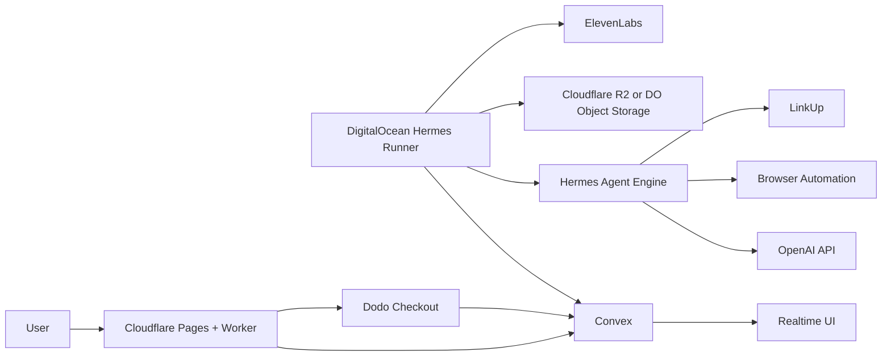

# GrimReaper Architecture

## Summary

GrimReaper is a Cloudflare-hosted web app backed by Convex realtime state and a DigitalOcean-hosted Hermes Runner. Cloudflare handles the public surface and protection. Convex stores durable state and live progress snapshots. DigitalOcean does all expensive scan work through Hermes, browser automation, OpenAI, LinkUp, artifact generation, and ElevenLabs calls.

## Runtime Responsibilities

**Cloudflare**

- Hosts the frontend and public result pages.
- Provides the submission endpoint, edge rate limits, bot protection, redirects, and cache headers.
- Can store screenshots, audio, and share images in R2 if chosen.
- Must not run Hermes or long browser scans.

**Convex**

- Owns the canonical state for submitted apps, scan runs, persona summaries, payment state, result pages, and leaderboard.
- Provides realtime subscriptions for active scan progress.
- Acts as the job queue through indexed `scanRuns` documents.
- Stores bounded summaries and artifact URLs, not raw traces or large files.

**DigitalOcean Hermes Runner**

- Runs a long-lived Python service with Hermes installed from `NousResearch/hermes-agent`.
- Polls/claims queued scans from Convex.
- Starts one Hermes manager agent per scan.
- Uses Hermes subagents for personas, browser execution, inspection, UX friction, failure classification, and final publishing summaries.
- Uploads screenshots/audio/report artifacts outside Convex.
- Writes progress to Convex at bounded intervals.

**Provider Usage**

- OpenAI: persona generation, orchestration reasoning, structured failure classification, verdict text, fix suggestions.
- LinkUp: optional URL/company/page context discovery before browser testing.
- ElevenLabs: text-to-speech only after final verdict text is committed.
- Dodo Payments: one-time checkout for Deep Exorcism scans, confirmed through webhook before unlocking paid limits.

## Scan Flow

1. User enters a URL and scan mode.
2. Cloudflare Worker validates URL, applies rate limits, and calls Convex to create a queued `scanRun`.
3. UI subscribes to the `scanRun` and shows queued/running/completed state.
4. DO Hermes Runner polls Convex for queued work and atomically claims one run.
5. Runner normalizes scan config from tier: free or deep.
6. Runner optionally calls LinkUp for public context.
7. Hermes manager creates a scan plan and delegates persona tasks.
8. Persona subagents perform bounded browser checks and return summaries.
9. Runner stores selected screenshots and generated artifacts outside Convex.
10. Failure classifier produces structured result fields.
11. Convex receives the final result, public slug, leaderboard fields, and certificate data.
12. ElevenLabs generates audio if enabled and the run has a final verdict.
13. Public result page renders a death certificate or survival badge.

## Reliability Rules

- A scan can complete without LinkUp context.
- A scan can complete without ElevenLabs audio.
- A scan can complete with lightweight page inspection if browser automation fails.
- A payment failure must not break free scans.
- Convex writes should be idempotent and keyed by `scanRunId`.
- Runner claiming must prevent duplicate processing when multiple runners are eventually added.

## Production Default

Use this for the first shippable demo:

- Frontend: Cloudflare Pages.
- Edge API: Cloudflare Worker.
- State: Convex Starter.
- Runner: single DigitalOcean VM, one Python process managed by systemd or Docker Compose.
- Runner concurrency: `2`.
- Artifact storage: Cloudflare R2 if available; otherwise DO Spaces.
- Browser backend: Hermes local headless Chromium via `agent-browser`.
